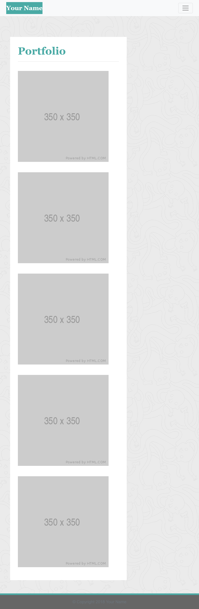

# responsivePortfolio
GW Coding Bootcamp Homework #2 

## Deploy URL
(https://technikks.github.io/responsivePortfolio/)

## Purpose
Create a mobile responsive design to the application to ensures that web applications render well on a variety of devices and window or screen sizes. 

* Use Boostrap CSS Framework to create a mobile responsive portfolio for the following webpages: 
    * Home
        * The below screenshots were used as reference: 
            * 
            * 
            * 
    * Portfolio
        * The below screenshots were used as reference: 
            * 
            * 
            * 
    * Contact
        * The below screenshots were used as reference: 
            * 
            * 
            * 

* Use Bootstrap to develop portfolio with the following items: 
    * A navbar
    * A responsive layout
    * Responsive images
